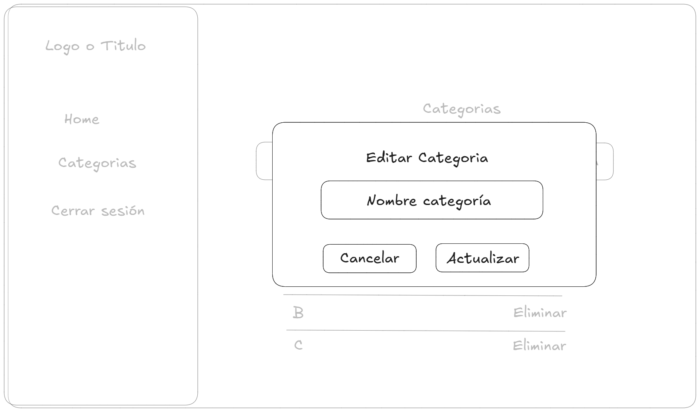

# TodoList
Gestor de tareas hecho en React para la interfaz de usuario, y Supabase para la base de datos y la autenticacion

# Introducción

## Problematica
En la actualidad, muchas personas estan constantemente realizando una gran cantidad de actividades al día para aumentar su productividad, y mejorar su calidad de vida personal y laboral. Por el otro lado, al tener una gran cantidad de responsabilidades, las personas tienden a olvidar sus tareas y pueden haber problemas debido a ello. Por este motivo existe la necesidad de una solución que pueda ayudar a las personas a gestionar sus tareas con opciones de categorización personalizadas para cada usuario.

## Descripción general del sistema
El sistema **TodoList** se encarga de la gestión de tareas, creación y vinculación de categorías con las tareas para cada usuario, haciendo la aplicación más personalizable y dinámica.

## Objetivo General
Implementar una aplicación web que facilite la gestión de responsabilidades mediante una organización por categorias

## Objetivos especfícos
* Implementar una interfaz web intuitiva.
* Integrar un sistema de autenticación para personalizar la aplicación a cada usuario.
* Desarrollar un sistema de gestión de categorías para que puedan ser vinculadas con las tareas
* Implementar un sistema de gestión de tareas atractiva y sencilla para el usuario.

## Alcance
El proyecto se enfocará en la gestión de tareas y categorías personales. Y se incluirá funcionalidades de autenticación, registro de usuarios, donde la información será almacenada sistema de terceros.
El sistema no incluirá funcionalidades de notificaciones, autorización de recursos ni integración o desarrollo de sistemas de gestión de tiempo.

# Analisis de requisitos

## **Historias de usuario trabajadas**

## Requisitos no funcionales

### Crear aplicación cliente en react
Como desarrollador  
Quiero crear la aplicacion cliente en React  
Para poder ofrecer una interfaz dinamica y ligera  

**Criterios de aceptación**

- La aplicacion debe estar en la version 18.3.1
- Debe usar vite para el montaje de la aplicacion

---

### Instalación Tailwind CSS
Como desarrollador  
Quiero usar el framework tailwind  
Para poder tener una interfaz de usuario atractiva a la vista pero fácil de implementar  

**Criterios de aceptación**

- Solo se usará un archivo que es `index.css` para la importación de tailwind
- Se usará la version 4.1 de tailwind

---

### Crear base de datos en Supabase
Como desarrollador  
Quiero crear la base de datos en supabase  
Para no tener que crear un backend aparte para el funcionamiento de la aplicacion  

**Criterios de aceptación**

- La base de datos tiene que ser PosgreSQL
- Se tiene que contar con referencias a la tabla para la autenticacion
- Sin Row Level Security
- Las credenciales para la conexion a la base de datos deben estar en un archivo .env

---

### Componente de inicio de sesión
Como desarrollador  
Quiero tener un componente de inicio de sesión  
Para que los usuarios de la aplicación puedan autenticarse  

**Criterios de aceptación**

- El componente de inicio de sesión debe contener el campo "correo"
- El componente de inicio de sesión debe contener el campo "contraseña"
- Se debe tener una redirección opcional al formulario de registro si el usuario no tiene una cuenta.
- Se debe tener un botón para que el usuario pueda validar sus credenciales e ingresar a la página si están correctas.

---

### Componente de registro
Como desarrollador  
Quiero tener un componente de registro  
Para que mis usuarios puedan registrarse y poder usar mi aplicación  

**Criterios de aceptación**

- El Formulario debe tener un campo de "Correo"
- El componente debe tener un campo para ingresar la contraseña
- El componente debe tener un campo para confirmar su contraseña
- Se debe tener un botón para poder registrar una cuenta
- El componente debe tener una forma de redireccionar al usuario si este ya tiene registrada una cuenta.

---

### Uso del patrón de diseño Singleton
Como desarrollador  
Quiero usar el patrón singleton en cliente de conexión con Supabase  
Para no tener que crear multiples instancias innecesarias de la conexión a la base de datos.  

**Criterios de aceptación**

- El Singleton debe estar contenido en una clase  
- Se debe aplicar Lazy Singleton, ya que no en todo momento se va a necesitar el cliente de Supabase  
- La configuración de la conexión debe estar ubicado en un archivo .env sin ser publicado al repositorio remoto

---

### Uso del patrón de diseño Strategy
Como desarrollador  
Quiero implementar el patrón Strategy  
Para poder simplificar el cambio de validación de formularios de la aplicación  

**Criterios de aceptación**

- Se tendrá una clase ValidationForm que será la que contendrá la estrategia
- Se creará una función SetStrategy con el que se podrá cambiar de estrategia
- Se tendrá un metodo general llamado Validate para usarlo en cualquier tipo de formulario

---

### Rutas protegidas
Como desarrollador  
Quiero implementar rutas protegidas  
Para que los usuarios tengan que autenticarse antes de obtener todos los beneficios de la aplicación  

**Criterios de aceptación**

- Se tendrá un componente que va a envolver a las rutas que tengan que estar protegidas
- Se usará el cliente de supabase para verificar que el cliente esté autenticado, incluso cuando se recargue la pagina
- La librería a usar será React-Router-Dom de la versión 6 en adelante.

---

### Layout de gestión de tareas
Como desarrollador  
Quiero implementar un Layout en mi aplicación  
Para que los usuarios se sientan comodos al navegar por la aplicacion  

**Criterios de aceptación**

- El layout tendrá un Sidebar para la navegación por la aplicación
- El Sidebar va a contener redirecciones a la pagina principal, categorías y para cerrar sesión
- EL contenido principal será mostrado a lado derecho del sidebar

---

## Requisitos funcionales

### Registrar cuenta

Como usuario  
Quiero registrarme en la aplicación  
Para poder obtener todos los beneficios que me brinda la gestión de tareas  

**Criterios de aceptación**

- Dado que el usuario esté en la página de registro  
Cuando ingrese su correo, contraseña y repita su contraseña correctamente  
Entonces el sistema registrará al usuario  

- Dado que el usuario esté en la página de registro  
Cuando ingrese un correo que ya se encuentre registrado  
Entonces el sistema advertirá al usuario de que esa cuenta ya existe  

- Dado que el usuario esté en la pagina de registro  
Cuando ingrese su correo correctamente, pero las contraseñas no coincidan  
Entonces se mostrará un mensaje de error al usuario indicando que las contraseñas no coinciden  

- Dado que el usuario esté en la pagina de registro  
Cuando ingrese un correo no valido  
Entonces se mostrará un mensaje de error indicando que el correo no es válido  

---

## Iniciar sesión

Como usuario  
Quiero poder iniciar sesión en la aplicación  
Para poder acceder a mis tareas y categorías personalizadas.  

**Criterios de aceptación**

- Dado que el usuario esté en el inicio de sesión  
Cuando ingrese su correo y contraseña correctamente  
Entonces el sistema lo redireccionará a la sección del Home.  

- Dado que el usuario esté en el inicio de sesión  
Cuando no rellene la sección de correo  
Entonces el sistema mostrará un mensaje indicando que el correo es obligatorio.  

- Dado que el usuario esté en el inicio de sesion  
Cuando no rellene la sección de contraseña  
Entonces el sistema mostrará un mensaje de error indicando que la contraseña es obligatoria.  

- Dado que el usuario esté en el inicio de sesión  
Cuando ingrese un correo inválido  
Entonces el sistema mostrará un mensaje de error indicando que el correo es inválido.  

- Dado que el usuario esté en el inicio de sesión  
Cuando ingrese incorrectamente sus credenciales  
Entonces el sistema indicará el error "Credenciales incorrectas" al usuario.  

---

### Crear categorías

Como usuario  
Quiero poder crear distintas categorías   
Para organizar mis tareas de una mejor manera  

**Criterios de aceptación**

- Dado que el usuario esté en la página principal  
Cuando ingrese a la página de categorías  
Entonces podrá ver un botón "Crear categoria"  

- Dado que el usuario esté en el formulario de crear categoría  
Cuando ingrese un nombre de categoría no vacio  
Entonces el sistema creará la categoría correctamente   

- Dado que el usuario esté en el formulario de crear categoría  
Cuando ingrese un nombre de categoría ya creado  
Entonces el sistema le indicará al usuario que ese nombre de categoría ya existe  

---

### Obtener categorías

Como usuario  
Quiero obtener las categorías que yo he creado  
Para tener constancia de cuantas categorías tengo y cuales ya he creado.  

**Criterios de aceptación**

- Dado que el usuario esté autenticado en la aplicación  
Cuando entre a la sección de categorías  
Entonces podrá ver todas las categorías creadas  

- Dado que el usuario esté en la sección de categorías  
Cuando haya creado una nueva categoría  
Entonces el sistema deberá mostrar la lista actualizada de categorías  

- Dado que el usuario esté autenticado en la aplicación  
Cuando entre a la sección de categorías y no tenga ninguna categoría creada  
Entonces se mostrará un mensaje indicando que no existen categorías  

---

### Editar categorías

Como usuario  
Quiero editar mis propias categorías  
Para actualizar mi información y no tener que eliminar y crear otra categoría nueva.  

**Criterios de aceptación**

- Dado que el usuario esté en la sección de categorías  
Cuando seleccione la opción de editar  
Entonces le saldrá un modal para que pueda editar la categoría  

- Dado que el usuario esté en el modal de edición de categorías  
Cuando ingrese un nombre no existente y le de click al botón de Actualizar  
Entonces el sistema actualizará el nombre de la categoría  

- Dado que el usuario esté en el modal de edición de categorías  
Cuando ingrese un nombre existente y le de click al botón de Actualizar  
Entonces le saldrá un mensaje de que no puede actualizar el nombre debido a que ya existe ese nombre  

- Dado que el usuario esté en el modal de edición de categorias  
Cuando ingrese un nombre de categoría y le dé al botón de Cancelar  
Entonces el sistema no actualizará nada de los datos  

---

### Eliminar categorías

Como usuario  
Quiero eliminar mis categorías  
Para gestionar categorías antiguas o que ya no las necesite.  

**Criterios de aceptación**

- Dado que el usuario esté autenticado en la aplicación  
Cuando le de click al botón de eliminar  
Entonces el sistema eliminará la información seleccionada.  

- Dado que el usuario esté autenticado en la aplicación  
Cuando le de click al botón de eliminar  
Entonces el sistema actualizará la lista de categorías.  

- Dado que el usuario esté autenticado en la aplicación  
Cuando le de click al botón de eliminar y ocurra un error  
Entonces el sistema mostrará un mensaje de error al usuario.  

### Crear tarea

Como usuario
Quiero crear mis propias tareas
Para poder organizarme mejor en mi dia a dia

**Criterios de aceptación**

- Dado que el usuario esté autenticado en la aplicación  
Cuando le de click a botón Crear tarea  
Entonces se le mostrará un formulario para crear la tarea.  

- Dado que el usuario esté autenticado en la aplicación  
Cuando ingrese al formulario de crear tarea  
Entonces podrá crear una tarea con los campos de titulo, descripción opcional, fecha limite, y una categoria opcional.  

- Dado que el usuario esté autenticado en la aplicación  
Cuando rellene los campos correctamente entonces y le de click a botón de crear  
Entonces el sistema guardará la información y notificará al usuario de que la operación fue existosa.  

- Dado que el usuario esté autenticado en la aplicación  
Cuando rellene los campos incorrectamente o deje vacio algunos campos obligatorios  
Entonces el sistema mostrará mensajes de error en los campos afectados.  

---

### Conseguir tareas

Como usuario  
Quiero poder obtener todas mis tareas  
Para definir el progeso y las acciones de mi dia.  

**Criterios de aceptación**

- Dado que el usuario esté autenticado  
Cuando ingrese a la sección de Home  
Entonces podrá ver sus tareas con titulo, descripcion, fecha limite, y categoria si es que tiene.  

- Dado que el usuario esté autenticado  
Cuando ingrese a la sección de Home y no tenga tareas  
Entonces el sistema indicará al usuario que no tiene tareas creadas.  

---

### Editar tarea

Como usuario  
Quiero poder editar mis tareas  
Para arreglar mis errores o modificarlas si ocurre un cambio de planes en mis responsabilidades.  

**Criterios de aceptación**

- Dado que el usuario esté autenticado en la aplicación  
Cuando acceda a la opción de editar tarea  
Entonces el sistema mostrará un formulario donde el usuario podrá editarla.  

- Dado que el usuario esté en el formulario de edición  
Cuando ingrese los campos de manera válida  
Entonces el sistema notificará al usuario que se ha actualizado la tarea  

- Dado que el usuario esté en el formulario de edición  
Cuando ingrese los campos de manera inválida  
Entonces el sistema notificará al usuario que existen errores.  

---

### Eliminar tarea

Como usuario  
Quiero eliminar mis tareas  
Porque necesito limpiar mi espacio de trabajo de tareas o recordatorios que ya no necesito.  

**Criterios de aceptación**

- Dado que el usuario esté autenticado en la aplicación  
Cuando le de click al botón de eliminar una tarea  
Entonces el sistema eliminará esa tarea y actualizará la lista de tareas.  

- Dado que el usuario esté autenticado en la aplicación  
Cuando le de click al botón de eliminar una tarea pero exista un error  
Entonces el sistema notificará al usuario del error mediante una alerta.  

---

### Gestionar tarea

Como usuario  
Quiero poder gestionar mis tareas  
Para indicar si una tarea fue completada o no.  

**Criterios de aceptación**

- Dado que el usuario esté autenticado en la aplicación  
Cuando una tarea esté sin completar y la marque como completada  
Entonces el sistema actualizará la apariencia de la tarjeta y guardará la información en la base de datos.  

- Dado que el usuario esté autenticado en la aplicación  
Cuando una tarea esté completada y la marque como no completada  
Entonces el sistema actualizará la apariencia de la tarjeta y guardará la información en la base de datos.  

---

# Diseño del sistema

## Diagrama de Modelo entidad-relación (ER)


## Diseño de interfaces de usuario por página

### Layout


### Inicio de sesión


### Registro


### Categorias

**Crear categorias**  


**Obtener categorias**  


**Obtener categorias vacio**  


**Editar categorias**  


### Tareas

**Formulario de creación de tareas**  


**Eliminar una tarea**


**Obtener tareas**  


**Tarjeta de tarea (completado / no completado)**  


## Diagramas de flujo realizados

**Inicio de sesión**  


**Registro de usuario**  


# Implementación

**[Ejecución del proyecto y pruebas ↗](./TodoList-FinalProject/README.md)**

## Tecnologías utilizadas

- Supabase
    - Autenticación
    - PostgreSQL
- React
- Vitest
- Tailwind

## Patrones de diseño aplicados

### Patrón Singleton
#### Porqué uso Singleton en mi proyecto?
Uso el patrón Singleton en mi proyecto ya que la conexión a la base de datos es un factor de carga importante a la aplicación de gestión de tareas, ya que cada vez que se solicita el cliente la aplicación se detiene por unos segundos. Además que la conexión a la base de datos no cambia con respecto al usuario que lo use. En conclusión, aplicar este patrón nos sirve para minimizar la carga y mejorar el rendimiento general de la aplicación.

  
Esta única instancia se va a utilizar tanto para la autenticación como para el acceso a la base de datos

#### Codigo base

```js
import { createClient } from "@supabase/supabase-js"

const supabaseUrl = import.meta.env.VITE_SUPABASE_URL;
const supabaseAnonKey = import.meta.env.VITE_SUPABASE_ANON_KEY;

class SupabaseClient {

    static #instance = null;

    constructor() {
        if(!SupabaseClient.#instance){
            SupabaseClient.#instance = createClient(supabaseUrl, supabaseAnonKey);
        }
        
        return SupabaseClient.#instance;
    }

}


export default SupabaseClient;
```

Esta clase nos asegura tener una única instancia en toda la aplicación. Donde se requiera usar el cliente, se puede usar el operador `new` normalmente y la implementación interna devolverá siempre el mismo. Esta implementación tambien asegura no instanciar el objeto si no se requiere que es denominado como `Lazy Singleton`.


### Patrón Strategy
El patrón Strategy nos permite definir de manera abstracta el manera en como se va a validar un formulario, permitiendonos cambiar esta estrategia en cualquier momento si lo necesitamos y así no tener que cambiar o modificar lineas de código existente, ya que todo se va a manejar mediante la clase abstracta ValidationForm.


> A pesar de que JavaScript no es un lenguaje orientado a objetos, el patrón Strategy sirve para mejorar el entendimiento del código y el mantenimiento futuro, ya que si por alguna razón tenemos que cambiar de estrategia o modificar la actual, no tendremos que cambiar las lineas en donde se usa esta strategia, debido a que estaremos usando el método validate de la clase contexto que es ValidateForm.

#### Código base


**Clase contexto**
```js
class ValidationForm {

    #strategy = null;

    constructor(strategy = null) {
        this.#strategy = strategy;        
    }

    validate(form) {
        if(!this.#strategy)
            throw new Error("No se ha definido una estrategia");

        return this.#strategy.validate(form);
    }

    setStrategy(newStrategy) {
        this.#strategy = newStrategy;
    }

}

export default ValidationForm;
```

**Clase estrategia**
```js
class SignInFormValidator {

    validate(signInForm) {
        const errors = {};
        const emailRegex = /^[^\s@]+@[^\s@]+\.[^\s@]+$/;

        if(!signInForm.email.trim())
            errors.email = "El correo es requerido";
        else if(!emailRegex.test(signInForm.email))
            errors.email = "El correo es invalido";

        if(!signInForm.password.trim())
            errors.password = "La contraseña es requerida";

        return errors;
    } 
}


export default SignInFormValidator;
```

**Ejemplo de uso**
```js
const validate = () => {
    const validator = new ValidationForm(new SignInFormValidator());
    const formErrors = validator.validate(user);

    const existErrors = Object.keys(formErrors).length !== 0;
    setErrors((existErrors ? formErrors : null));

    return !existErrors;
}
```

Con este ejemplo, si quisieramos cambiar la estrategia de validación del formulario del inicio de sesión, debemos solamente crear otra clase que cumpla las reglas de la clase contexto `ValidationForm` y modificar la estrategia de inicio. Así logramos mejorar la mantenibilidad de código a largo plazo y desacoplar las validaciones específicas de cada formulario.

## Estructura del proyecto


```
TodoList-FinalProject/
|       
├── src/                  # Código fuente
│   ├── assets/           # Recursos estáticos
│   ├── components/       # Componentes React reutilizables
│   ├── context/          # Contextos de React
│   ├── hooks/            # Custom hooks
│   ├── pages/            # Páginas/Rutas principales
│   ├── services/         # Servicios, lógica de negocio, patrones de diseño
│   └── tests/            # Pruebas unitarias
├── .env.example          # Ejemplo de variables de entorno
├── index.html            # Punto de entrada HTML
├── package.json          # Dependencias y scripts
└── vite.config.js        # Configuración de Vite con las pruebas unitarias y TailwindCSS
```

# Lecciones aprendidas

En estas dos semanas que tuve para realizar el proyecto he comprendido y mejorado en muchos aspectos que me ayudará a crecer como profesional.

* Investigación: He aprendido a solventar problemas debido a la falta de conocimiento con una tecnología, donde he podido investigar y aplicar lo aprendido para concluir con el proyecto.
* Organización: Con otros exámenes finales en curso, he podido organizar mejor mi tiempo para las diferentes responsabilidades de cada materia sin dejar de lado a otras.
* Documentación: Entender al usuario es una de las tareas mas dificiles en el desarrollo de software y la documentación nos ayuda a formar un método de comunicación entre los desarrolladores e interesados. Además que se deja por escrito todas las acciones y responsabilidades que tiene el desarrollador al momento de la elaboración del proyecto.